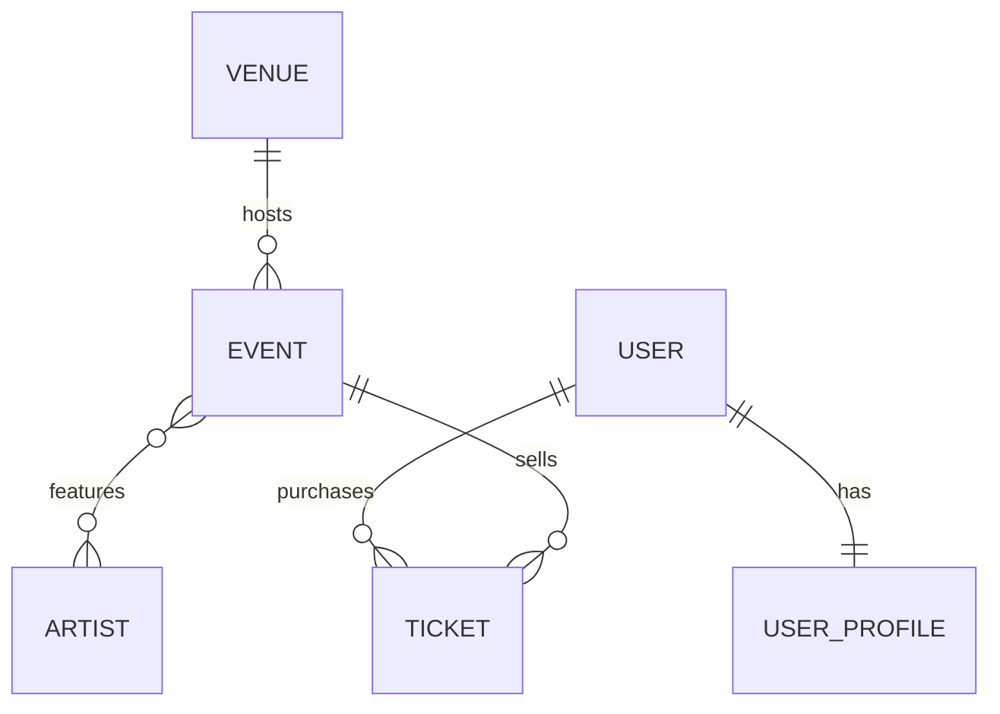

# PulsePass

Plataforma de eventos, artistas y entradas. Caso de estudio académico enfocado en la **capa de persistencia**: modelo relacional, migraciones Flyway, entidades JPA, repositories Spring Data, consultas y pruebas de integración contra PostgreSQL real.

## Tecnologías

- Java 21
- Spring Boot 4 (Spring Data JPA / Hibernate)
- PostgreSQL
- Flyway (único responsable del esquema)
- Testcontainers (PostgreSQL real en las pruebas, sin H2)
- Maven

## Requisitos

- JDK 21
- Docker en ejecución (Testcontainers levanta PostgreSQL automáticamente; no hace falta instalar PostgreSQL para correr las pruebas)

## Modelo de dominio



| Entidad | Atributos principales |
|---|---|
| Venue | code (único), name, city, address, capacity (> 0), active |
| Event | eventCode (único), name, description, category, status, eventDate, minimumAge, streamingUrl (opcional), venue |
| Artist | stageName (único), genre, country, active |
| User | username (único), email (único), active |
| UserProfile | firstName, lastName, phone, city, birthDate, user (1:1, FK única) |
| Ticket | ticketCode (único), type, status, price, purchaseDate, user, event |

Los enums (`EventCategory`, `EventStatus`, `TicketType`, `TicketStatus`) se guardan por nombre (`@Enumerated(EnumType.STRING)`), no por ordinal, y la base de datos los restringe con `CHECK`.

**Decisiones de diseño**

- `Ticket` es una entidad y no un `@ManyToMany` entre `User` y `Event` porque tiene datos propios: código, tipo, precio, estado y fecha de compra.
- `Event` y `Artist` se relacionan N:M mediante la tabla `event_artists`, con clave primaria compuesta `(event_id, artist_id)` que impide repetir un par.
- Los precios usan `BigDecimal` / `NUMERIC(10,2)`, nunca `float` ni `double`.
- Las reglas críticas (unicidad, FKs, rangos) se refuerzan en PostgreSQL con `UNIQUE`, `FOREIGN KEY` y `CHECK`, no solo en Java.
- `SOLD_OUT` no se calcula automáticamente en este MVP.

## Migraciones Flyway

Ubicadas en `src/main/resources/db/migration`. Una base vacía se reconstruye ejecutándolas en orden.

| Migración | Objetivo |
|---|---|
| `V1__create_schema.sql` | Crea `venues`, `events`, `artists`, `event_artists`, `users`, `user_profiles` y `tickets` con PK, FK, UNIQUE, CHECK e índices |
| `V2__insert_initial_artists.sql` | Inserta los artistas iniciales: Solar Beat, Neon Waves, Caribbean Sound, Ocean Drive y Digital Pulse |
| `V3__add_streaming_url_to_event.sql` | Agrega `streaming_url VARCHAR(500)` nullable a `events` |

`spring.jpa.hibernate.ddl-auto=validate`: Hibernate solo valida el esquema, nunca lo crea ni lo modifica.

## Repositories y consultas

Todos extienden `JpaRepository`. Las consultas simples usan Query Methods; las que requieren joins, conteos o varios filtros usan JPQL.

| Repository | Método | Tipo | Requisito |
|---|---|---|---|
| `VenueRepository` | `findByCode` | Query Method | FR-VEN-001 |
| `ArtistRepository` | `findByStageName` | Query Method | FR-ART-001 |
| `UserRepository` | `findByEmailIgnoreCase`, `findByUsername` | Query Method | FR-USR-001 |
| `EventRepository` | `findByEventCode` | Query Method | FR-EVT-001 |
| `EventRepository` | `findByStatusOrderByEventDateAsc` | Query Method | FR-EVT-005 |
| `EventRepository` | `findByVenue_Code` | Query Method (navega relación) | FR-VEN-004 |
| `EventRepository` | `findByArtistStageName` | JPQL con JOIN y DISTINCT | FR-SRC-001, FR-ART-004 |
| `EventRepository` | `findByCityAndArtistStageName` | JPQL con varias asociaciones | FR-SRC-002 |
| `EventRepository` | `findRecommended` | JPQL con filtros, DISTINCT y orden | FR-SRC-003 |
| `TicketRepository` | `findByUser_Email`, `findByUser_EmailAndStatus` | Query Method (navega relación) | FR-TKT-006 |
| `TicketRepository` | `findByEvent_EventCodeAndStatus` | Query Method (dos igualdades simples) | FR-TKT-007 |
| `TicketRepository` | `countByEventCodeAndStatus` | JPQL con COUNT | FR-TKT-008 |
| `TicketRepository` | `findByEventDateAfter` | JPQL con JOIN y orden | FR-SRC-004 |

## Pruebas

Las pruebas de integración usan PostgreSQL real con Testcontainers. Flyway construye el esquema y luego se ejecutan los repositories. Cada prueba corre en una transacción que se revierte al terminar.

| Clase | Cubre |
|---|---|
| `FlywayMigrationIT` | V1, V2 y V3 desde una base vacía; `ddl-auto=validate` |
| `VenuePersistenceTest` | Persistencia de Venue, código único, capacidad válida |
| `EventRepositoryIT` | Venue 1:N Event, cartelera, código único, enums como texto |
| `EventArtistIT` | Event N:M Artist, sin pares duplicados |
| `UserProfileIT` | User 1:1 UserProfile, unicidad de username y email |
| `TicketRepositoryIT` | Ticket → User y Event, ventas PAID, restricciones UNIQUE, CHECK y FK |
| `EventSearchIT` | Búsquedas por artista, ciudad y eventos recomendados |

## Cómo ejecutar

Con Docker abierto, desde la raíz del proyecto:

```bash
# Windows
mvnw clean test

# Linux / macOS
./mvnw clean test
```

Debe terminar en `BUILD SUCCESS`.

El `pom.xml` configura Surefire para incluir también las clases terminadas en `IT`, que Maven ignora por defecto.

Para ejecutar la aplicación con una base de datos local, define las variables de entorno `DB_USERNAME` y `DB_PASSWORD` y crea una base llamada `pulsepass` en `localhost:5432`.

## Estructura

```
src/main/java/com/pulsepass/
  domain/          entidades JPA
  domain/enums/    EventCategory, EventStatus, TicketType, TicketStatus
  repository/      repositories Spring Data
src/main/resources/
  application.yaml
  db/migration/    V1, V2, V3
src/test/java/com/pulsepass/
  IntegrationTestBase.java
  migration/       FlywayMigrationIT
  repository/      pruebas de repositories
```