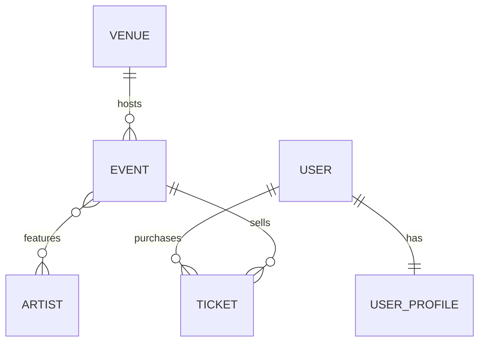

# PulsePass

Plataforma de eventos, artistas y entradas. Caso de estudio académico con dos capas implementadas:

1. **Persistencia**: modelo relacional, migraciones Flyway, entidades JPA, repositories Spring Data, consultas y pruebas de integración contra PostgreSQL real.
2. **Servicios**: reglas de negocio, transacciones, DTOs `record`, MapStruct y excepciones de dominio, con pruebas unitarias (JUnit 5, Mockito, AssertJ) que no necesitan base de datos.

## Tecnologías

- Java 21
- Spring Boot 4 (Spring Data JPA / Hibernate)
- PostgreSQL
- Flyway (único responsable del esquema)
- Testcontainers (PostgreSQL real en las pruebas de repository, sin H2)
- MapStruct (Entity → DTO)
- JUnit 5, Mockito y AssertJ (pruebas unitarias de Service)
- Maven

## Requisitos

- JDK 21
- Docker en ejecución (Testcontainers levanta PostgreSQL automáticamente; no hace falta instalar PostgreSQL para correr las pruebas)

## Modelo de dominio


```mermaid
erDiagram
    VENUE ||--o{ EVENT : hosts
    EVENT }o--o{ ARTIST : features
    USER ||--|| USER_PROFILE : has
    USER ||--o{ TICKET : purchases
    EVENT ||--o{ TICKET : sells
```

| Entidad | Atributos principales |
|---|---|
| Venue | code (único), name, city, address, capacity (> 0), active |
| Event | eventCode (único), name, description, category, status, eventDate, minimumAge, streamingUrl (opcional), venue |
| Artist | stageName (único), genre, country, active |
| User | username (único), email (único), active |
| UserProfile | firstName, lastName, phone, city, birthDate, user (1:1, FK única) |
| Ticket | ticketCode (único), type, status, price, purchaseDate, user, event |

Los enums (`EventCategory`, `EventStatus`, `TicketType`, `TicketStatus`) se guardan por nombre (`@Enumerated(EnumType.STRING)`), no por ordinal, y la base de datos los restringe con `CHECK`.

**Decisiones de diseño**

- `Ticket` es una entidad y no un `@ManyToMany` entre `User` y `Event` porque tiene datos propios: código, tipo, precio, estado y fecha de compra.
- `Event` y `Artist` se relacionan N:M mediante la tabla `event_artists`, con clave primaria compuesta `(event_id, artist_id)` que impide repetir un par.
- Los precios usan `BigDecimal` / `NUMERIC(10,2)`, nunca `float` ni `double`.
- Las reglas críticas (unicidad, FKs, rangos) se refuerzan en PostgreSQL con `UNIQUE`, `FOREIGN KEY` y `CHECK`, no solo en Java.
- `SOLD_OUT` lo actualiza la capa de servicios: la compra que completa la capacidad del venue cambia el evento a `SOLD_OUT` en la misma transacción.

## Migraciones Flyway

Ubicadas en `src/main/resources/db/migration`. Una base vacía se reconstruye ejecutándolas en orden.

| Migración | Objetivo |
|---|---|
| `V1__create_schema.sql` | Crea `venues`, `events`, `artists`, `event_artists`, `users`, `user_profiles` y `tickets` con PK, FK, UNIQUE, CHECK e índices |
| `V2__insert_initial_artists.sql` | Inserta los artistas iniciales: Solar Beat, Neon Waves, Caribbean Sound, Ocean Drive y Digital Pulse |
| `V3__add_streaming_url_to_event.sql` | Agrega `streaming_url VARCHAR(500)` nullable a `events` |

`spring.jpa.hibernate.ddl-auto=validate`: Hibernate solo valida el esquema, nunca lo crea ni lo modifica.

## Repositories y consultas

Todos extienden `JpaRepository`. Las consultas simples usan Query Methods; las que requieren joins, conteos o varios filtros usan JPQL.

| Repository | Método | Tipo | Requisito |
|---|---|---|---|
| `VenueRepository` | `findByCode` | Query Method | FR-VEN-001 |
| `ArtistRepository` | `findByStageName` | Query Method | FR-ART-001 |
| `UserRepository` | `findByEmailIgnoreCase`, `findByUsername` | Query Method | FR-USR-001 |
| `EventRepository` | `findByEventCode` | Query Method | FR-EVT-001 |
| `EventRepository` | `findByStatusOrderByEventDateAsc` | Query Method | FR-EVT-005 |
| `EventRepository` | `findByVenue_Code` | Query Method (navega relación) | FR-VEN-004 |
| `EventRepository` | `findByArtistStageName` | JPQL con JOIN y DISTINCT | FR-SRC-001, FR-ART-004 |
| `EventRepository` | `findByCityAndArtistStageName` | JPQL con varias asociaciones | FR-SRC-002 |
| `EventRepository` | `findRecommended` | JPQL con filtros, DISTINCT y orden | FR-SRC-003 |
| `TicketRepository` | `findByUser_Email`, `findByUser_EmailAndStatus` | Query Method (navega relación) | FR-TKT-006 |
| `TicketRepository` | `findByEvent_EventCodeAndStatus` | Query Method (dos igualdades simples) | FR-TKT-007 |
| `TicketRepository` | `countByEventCodeAndStatus` | JPQL con COUNT | FR-TKT-008 |
| `TicketRepository` | `findByEventDateAfter` | JPQL con JOIN y orden | FR-SRC-004 |

## Capa de servicios

Frontera entre las futuras capas de exposición (controllers) y el modelo persistente. Los contratos públicos **nunca devuelven entidades JPA**: reciben `record` de `dto.request` y retornan `record` de `dto.response`, mapeados con MapStruct.

```
Controller (futuro) → Service (interfaz) → ServiceImpl → Repository / Mapper / reglas de negocio → Entity → PostgreSQL
```

| Servicio | Operaciones | Reglas |
|---|---|---|
| `VenueService` | `findByCode`, `findActiveVenues` | BR-VENUE-001..002 |
| `ArtistService` | `findById`, `findByStageName`, `findActiveArtists` | BR-ARTIST-001..002 |
| `EventService` | `create`, `findByCode`, `findPublishedEvents`, `publish`, `addArtist`, `findByArtist` | BR-EVENT-001..011 |
| `UserService` | `register` (User + UserProfile), `findByEmail`, `findByUsername` | BR-USER-001..005 |
| `TicketService` | `purchase`, `findByCode`, `findByUserEmail`, `findPaidTicketsByEvent`, `cancel`, `markAsUsed` | BR-TICKET-001..014 |

**Decisiones de diseño**

- Inyección por constructor con dependencias `final`; interfaz en `service/`, implementación en `service/impl/`.
- Escrituras con `@Transactional`; lecturas con `@Transactional(readOnly = true)` (por defecto en la clase, las escrituras lo sobrescriben).
- Tres excepciones: `ResourceNotFoundException` (el recurso no existe), `DuplicateResourceException` (conflicto de unicidad) y `BusinessRuleException` (el recurso existe pero la operación no es válida).
- Los DTO de request solo llevan validación estructural (`@NotBlank`, `@NotNull`, `@Size`). Las reglas de negocio (fecha futura, edad mínima, etc.) están en el Service y lanzan `BusinessRuleException`.
- El reloj (`Clock`) se inyecta: en producción es el real y en los tests es fijo, así las reglas de fecha y edad son deterministas.
- **Precio**: el cliente nunca lo envía. `TicketPriceCalculator` lo calcula con `BigDecimal` (GENERAL = base, STUDENT = 0,60 × base, VIP = 2,5 × base, BACKSTAGE = 5 × base). La base se configura con `pulsepass.ticket.base-price` (por defecto 100000.00). El código del ticket lo genera `TicketCodeGenerator`.
- **Compra atómica**: valida usuario, evento, estado, fecha, edad (calculada **a la fecha del evento**) y capacidad (`paidTickets < venue.capacity`); crea el ticket `PAID` y, si completa la capacidad, pasa el evento a `SOLD_OUT`. Cualquier fallo hace rollback.
- Si el evento exige edad mínima y el usuario no tiene perfil (sin fecha de nacimiento), la compra se rechaza.

**Limitación conocida (PRD, sección 53)**: contar tickets y luego guardar no es seguro ante compras concurrentes. Una versión de producción necesitaría locking optimista/pesimista o restricciones en la base de datos. Además, la capacidad cuenta solo tickets `PAID`: un ticket que pasa a `USED` libera su cupo.

## Pruebas

**Repositories (integración)**: usan PostgreSQL real con Testcontainers. Flyway construye el esquema y luego se ejecutan los repositories. Cada prueba corre en una transacción que se revierte al terminar.

| Clase | Cubre |
|---|---|
| `FlywayMigrationIT` | V1, V2 y V3 desde una base vacía; `ddl-auto=validate` |
| `VenuePersistenceTest` | Persistencia de Venue, código único, capacidad válida |
| `EventRepositoryIT` | Venue 1:N Event, cartelera, código único, enums como texto |
| `EventArtistIT` | Event N:M Artist, sin pares duplicados |
| `UserProfileIT` | User 1:1 UserProfile, unicidad de username y email |
| `TicketRepositoryIT` | Ticket → User y Event, ventas PAID, restricciones UNIQUE, CHECK y FK |
| `EventSearchIT` | Búsquedas por artista, ciudad y eventos recomendados |

**Servicios (unitarias)**: `@ExtendWith(MockitoExtension.class)`, Service real con Repository y Mapper simulados. No usan `@SpringBootTest`, ni PostgreSQL, ni Docker. Cada prueba sigue ARRANGE / ACT / ASSERT y usa `when`, `verify`, `verify(..., never())`, `any()` y `eq()`.

| Clase | Cubre |
|---|---|
| `VenueServiceImplTest` | BR-VENUE-001..002 |
| `ArtistServiceImplTest` | BR-ARTIST-001..002 |
| `EventServiceImplTest` | TEST-EVENT-001..008, BR-EVENT-001..011 |
| `UserServiceImplTest` | TEST-USER-001..004, BR-USER-001..005 |
| `TicketServiceImplTest` | TEST-TICKET-001..012, escenario de aceptación AC-004..AC-011 |
| `TicketPriceCalculatorTest` | Estrategia de precios, BR-TICKET-009 |

## Cómo ejecutar

Con Docker abierto (las pruebas de repository lo necesitan; las de Service no), desde la raíz del proyecto:

```bash
# Windows
mvnw clean test

# Linux / macOS
./mvnw clean test
```

Debe terminar en `BUILD SUCCESS`.

El `pom.xml` configura Surefire para incluir también las clases terminadas en `IT`, que Maven ignora por defecto.

Para ejecutar la aplicación con una base de datos local, define las variables de entorno `DB_USERNAME` y `DB_PASSWORD` y crea una base llamada `pulsepass` en `localhost:5432`.

## Estructura

```
src/main/java/com/pulsepass/
  domain/          entidades JPA
  domain/enums/    EventCategory, EventStatus, TicketType, TicketStatus
  repository/      repositories Spring Data
  dto/request/     CreateEventRequest, RegisterUserRequest, PurchaseTicketRequest
  dto/response/    VenueResponse, EventResponse, EventSummaryResponse, ArtistResponse, UserResponse, TicketResponse
  mapper/          mappers MapStruct (Entity → DTO)
  exception/       ResourceNotFoundException, DuplicateResourceException, BusinessRuleException
  service/         interfaces de servicio
  service/impl/    implementaciones @Service
  service/pricing/ TicketPriceCalculator, TicketCodeGenerator
src/main/resources/
  application.yaml
  db/migration/    V1, V2, V3
src/test/java/com/pulsepass/
  IntegrationTestBase.java
  migration/       FlywayMigrationIT
  repository/      pruebas de repositories
  service/impl/    pruebas unitarias de Service (Mockito)
  service/pricing/ prueba de TicketPriceCalculator
```